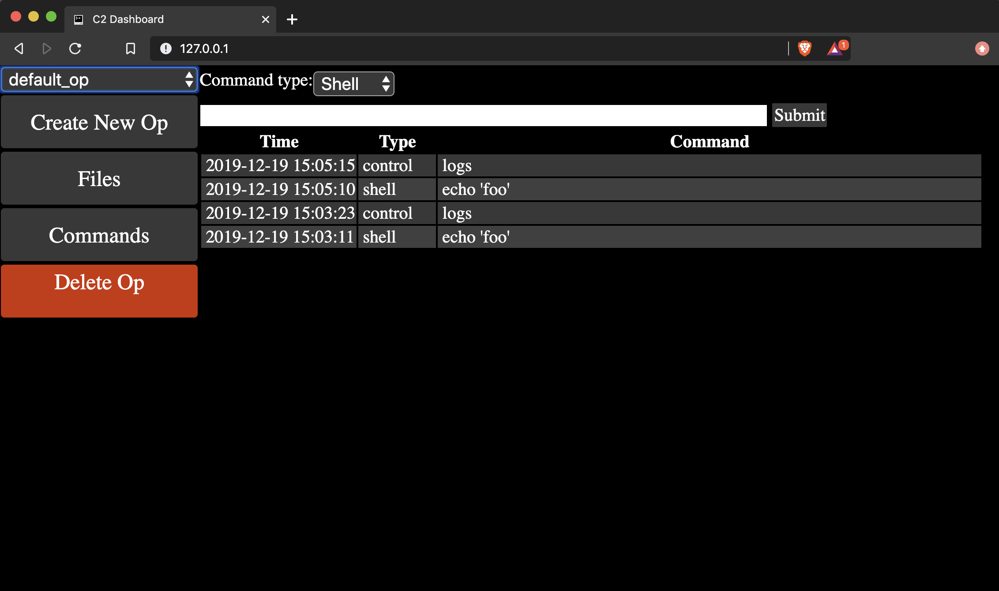
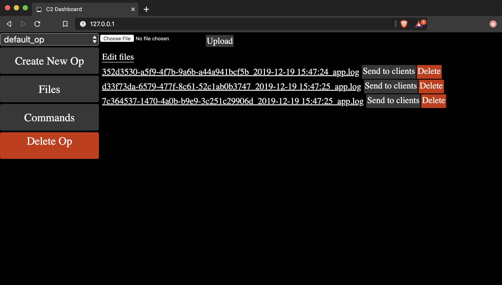

# Gothmog
Gothmog is a package consisting of Python and Node.js applications for deploying a simple botnet.

### Architecture
Gothmog consists of three components:
- A Python server that manages the clients through a unified json API.
- A Python client that connects to the server to receive and execute commands.
- A Node.js server that provides a simple interface for interacting with the server.

### Requirements
The Python API and client are built using Python 3, and have distinct requirements.txt files in their respective folders. Each folder has a `setup.sh` file that can be run to automatically create a virtual environment, and install their required packages. If you don't want a virtual environment, have problems with the installation, or simply want to install the packages yourself, you can navigate to the folder of the component you want to install, then run `pip install -r requirements.txt`.

The web UI is built with Node.js, and can be installed using `npm install` in the `web` folder of the repository. This should take care of installing all necessary dependencies.

### Initial setup
After installation, there are some things that may need to be adjusted for your local environment. 

In the `client` folder, you may want to customize the log file used by the client. By default, logs are stored in a file called `app.log` in the same directory as the client code. This can be changed in the `config.py` file in the client folder.

In the `server` folder, you can similarly change where server logs are output. Additionally, the server has some built-in access control for certain functionality, such as issuing new commands to the clients. By default, it allows the following local address ranges:
- 127.0.0.0/8
- 10.0.0.0/8
- 172.16.0.0/12
- 192.168.0.0/16

These values can be removed if necessary by editing the `__init__` function in the HostDict class. If you want to add additional allowed ip addresses, you can create a file called `allowed_addresses.txt` in the `server` folder, and write additional host subnets for the server to load. These should be in the form of `X.X.X.X/X`. If you did not run the `setup.sh` script in the server folder, you will additionally need to make the `server/apps/files/uploaded_files` directory, as this is where the server saves uploaded files to.

In the `web` folder, you will need to make some changes to the `settings` object in `settings.js`. If the `site_url` is not changed, the web UI simply will not work correctly. This value should reflect the full address where the web UI is hosted, e.g. `http://127.0.0.1`. This value is what is used in the template for rendering links on the webpage. You can optionally enable TLS by changing `https` to `true`, and changing the value of each `ssl_*` variable to the appropriate path. The `api_url` is used for templating the web UI to point to the appropriate address. If `api_url` is not set, it will default to the same address as the API, but on port 8080.

### Running
Before attempting to run each component, please be sure you have at least read through the `Initial Setup` section to ensure that you do not run into any problems.

##### Client
Launching the client locally is simple, simply activate your virtual environment as necessary, then run `python main.py <api_url> <op_name>`. The `api_url` should include the appropriate protocol and port as necessary, e.g. `http://127.0.0.1:8080`. The `op_name` can be any string that contains only alphanumeric characters, dashes, and underscores. This allows a single API server to run multiple concurrent ops for different users. 

If the client is launched using Docker, it expects environment variables `API_URL` and `OP_NAME`, otherwise it will default to the host machine on port 8080, and `default_op` respectively for these values. If you are running the client locally, and using the web UI's convenience buttons for downloading, these files will be saved to `/app/downloads`, so please be sure you have this directory available.

##### API Server
The API server uses waitress to serve the application, and `server.sh` will launch this for you. Waitress by itself doesn't support HTTPS, so if you want to encrypt the traffic, you will have to set it up behind a reverse proxy. By default, the `server.sh` script will launch the API on port 8080, but this can be changed by passing it the `-p` or `--port` argument, e.g. `./server.sh -p 9090`. When run with docker, this runs on port 8080 in the container. If you are using docker-compose, you can use the environment variable `API_PORT` to choose what port is forwarded to port 8080 on the container. If you are not using docker-compose, you can simply specify which port will be forwarded yourself, just make sure it is being forwarded to port 8080 on the container.

##### Web UI Server
The web UI is also easy to launch, simply enter the `web` folder and run `node app.js` to launch. By default, the web server runs on port 80, but this is changed in the `settings.js` file, not by passing arguments at runtime. When run with docker, it instead runs on port 8080 in the container. If you are using docker-compose, you can use the environment variable `WEB_PORT` to choose what port is forwarded to port 8080 on the container. If you are not using docker-compose, you can simply specify which port will be forwarded yourself, just make sure it is being forwarded to port 8080 on the container.

### Usage
As mentioned before, the web UI was built to hopefully be intuitive to use. In the top left corner is a dropdown menu to choose the op that you want to work with. Initially, none are selected, so you will need to select one to make use of any of the functionality. If you have not already created an op, you can do so with the button right below the dropdown menu. 

Upon selecting an op, you will be taken to the command screen. Here, you can select the type of command you want to issue, and see previously issued commands, sorted by recency. Again, there's a dropdown menu for the command type, and you can choose between `shell`, `python`, and `control`. 

`Shell` commands are run with Python's `os.system()` function, and behaves as though you were actually using a shell on the machine. These are run as the user running the python script, so keep this in mind if you are planning to run commands with sudo, or that otherwise might require elevated privileges. The docker containers are not run as root, and are alpine linux images, so be aware that their shell functionality may be quite limited. They were originally designed with the intent of running python scripts concurrently, so not much is installed on them.

`Python` commands run raw python that is input into the text box. This feature is still in development, and currently only supports one-liners in the web UI. Behind the scenes, it uses python's `exec()` function to run the code. If you were to send custom requests to the API endpoint, you could increase your mileage with this. However, if you are using the web interface, I recommend sending files to the clients and using shell commands to execute those files instead.

`Control` commands are miscellaneous functions for the bots that have specific useful behavior. Right now only two exist: `stop` and `logs`. The former halts the client, by telling the client script to call python's `exit()` function. The latter tells clients to upload their log files to the server for inspection.

There is also a `Files` section on the web UI. If you navigate to this section, you will be able to upload and download files to and from the server, as well as issue commands to the bots to download specific files using a convenience button. This is where you can find the clients' log files when you request them, as well as a location where you can upload scripts for the clients to download. For example, you might upload a tarball with a handful of python scripts, then navigate to the `Commands` page to tell the client what to do with those files. When clients download files using the convenience buttons on this page, they save them to `/app/downloads` for consistency. The convenience button is simply a way to issue a shell command instructing the bots to download the files from the server to a specific folder, so it will show up in the command history. It's worth noting that the files that are displayed are only files associated with the selected op, so be aware of this when you are working with multiple ops simulatenously.

Finally, when an op is selected, there is a `Delete Op` button. This will delete the op from the database, as well as its command history. Files are not deleted using this button, so be sure to delete them in the `Files` interface beforehand if you need to. If files are not deleted beforehand, and you create a new op with the same name, the old files will show up for that new op.

### Disclaimer
This code is _**not**_ designed to be used for unauthorized activity, it is intended to be used as a testing tool in environments where you are authorized to do so. It may be useful for simulating network load, small-scale stress testing, multi-device orchestration, or automation activities. Quite frankly, if you're hoping to deploy this to perform a DDoS, you'd be better off finding something else because deploying this at scale may be costly. 
